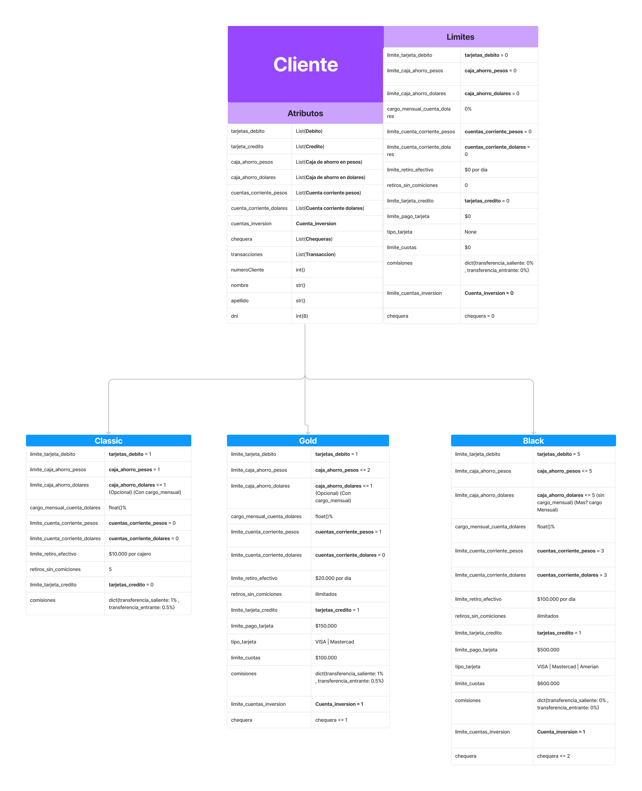
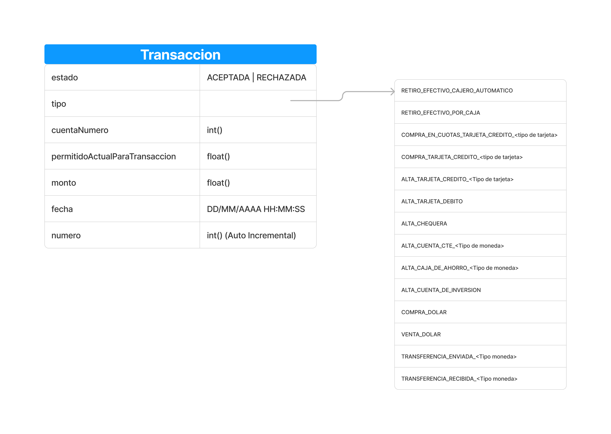

# ITBANK
Es el proyecto de una Aplicación web de Home Banking renovado para ser simple y fácil de utilizar.

El grupo que esta creando ITBANK es **iKnowHow** Conformado por: 
  - Franco Nicolás Dorrego
  - Laureano Ibarra
  - Evelyn Gazal

# Forma de Tester

Para testearlo simplemente ingresa con la **consola** a **Sprint_5** y ejecuta las pruebas:

- cd sprint_5

Luego de puede ejecutar entrando al archivo main.py correrlo. 

Para ejecutarlo se le tiene que aclarar la dirrecion del Json de donde salen los datos, esto se define el la varible que esta en main llamada 
**ARCHIVO_A_LEER**, si no existe emite en ValueError. Si se le quiere aclarar el archivo de salida solo se modifica la variable **ARCHIVO_A_DEVOLVER**.

## <h1>Diagrama de Flujo</h1>

Se siguen estos pasos: 

 1. Leemos el archivo y lo pasamos a un Json
 2. Con el Json instanciamos un tipo de cliente que sea necesario
 3. Iteramos en la lista de transacciones:
		 - Creamos un objeto transaccion
		 - Generamos el motivo
		 - Generamos el HTML y lo guardamos en una varible de instacia
 4. Agregamos la transaccion al cliente
 5. Genramos el HTML y le pasamos la variable de instancia.

## <h1>Diagrama de Clases</h1>

Diseñamos dos tipos de clases principales:

 ****

 ****

## <h1>Test</h1>

Para ejecutar los test, hay un archivo llado test.py el cual si se ejecuta se realizan todos los test para las 3 funciones de cliente que manejan parametros externos.

## <h1>Generacion de Motivos</h1>

Esta parte es bastante arbitraria ya que la consiga era confusa. Por eso nosotros adopatamos la sigiente logica:

- Si la transaccion esta Aprobada, el motivo es:
	- "Es correcta la transaccion"
- Si el permitido por operacion es menor al monto a operar:
	- "No tienes limite suficiente para operar con esta transaccion"
- Si no esta aprobada, se valida segun el tipo de accion, la gran mayoria de las veces si el cliente es classic, sale que no tiene acceso a esa funcion. Si es Black o Gold, esta figura sin fondos.

Esta funcion solo agrega el motivo, no valida que la accion sea correcta. 
Es decir si el cliente classic pidio una tarjeta y el sistma anterior el cual general el Json se la aprobo, nosotros solo agregamos que esta bien, ya que como se aclara en la consiga, el sistema anterior que genera el Json es el encargado de validar y aprobar las operaciones, nosotros solo de aclarar el porque.

Esta funcion esta en la clase Transaccion.

## <h1>Documentación del sprint 1</h1>

**[Documentación](./sprint_1/README.md)**

## <h1>Documentación del sprint 2</h1>

**[Documentación](./sprint_2/README_Sprint_2.md)**

## <h1>Documentación del sprint 3</h1>

**[Documentación](./sprint_3/README_Sprint_3.md)**

## <h1>Documentación del sprint 4</h1>

**[Documentación](./sprint_4/README.md)**
