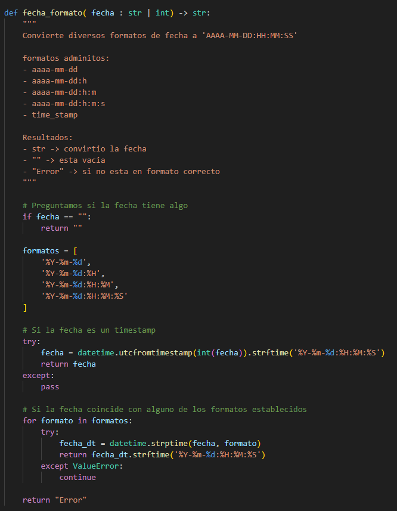

# ITBANK
Es el proyecto de una Aplicación web de Home Banking renovado para ser simple y fácil de utilizar.

El grupo que esta creando ITBANK es **iKnowHow** Conformado por: 
  - Franco Nicolás Dorrego
  - Laureano Ibarra
  - Evelyn Gazal

# Forma de Tester

Para testearlo simplemente ingresa con la **consola** a **Sprint_4** y ejecuta las pruebas:

- cd sprint_4

Acepta:

	-  python listado_cheques.py PATH_CSV DNI SALIDA TIPO -e ESTADO -f FECHA

- *PATH_CSV* : Es el directorio donde se busca la información. El mismo tiene que ser delimitados por "," y tener este formato:

		- nroCheque,codigoBanco,codigoSucursal,nroCuentaOrigen,nroCuentaDestino,valor,fechaOrigen,fechaPago,dni,estado,tipo 
 
 - *DNI*: Va a devolver todos los cheques que tiene este DNI, Tiene que ser un numero de 8 Dígitos.
 - *SALIDA*: Es por donde se muestran los datos, por PANTALLA o CSV. Si se selecciona CSV se crea un archivo en el directorio en donde esta el script con todos los datos. EJ: *./DNI_TIMESTAMP.CSV*
 -  *TIPO*:  Es el tipo de cheque, solo puede ser EMITIDO o DEPOSITADO
 -  *ESTADO*: Es un dato opcional, se llama como -e o --estado, solo acepta PENDIENTE, APROBADO, RECHAZADO.
 - *FECHA*: Es un dato opcional, es un rango de fechas, se llama como -f o --fecha, Se coloca en formato AAAA-MM-DD:AAAA-MM-DD

Los parámetros tienen que ser en mayúsculas.

## <h1>Diagrama de Flujo</h1>

Diseñamos un diagrama el cual explica como tratamos la información.

****

## <h1>Manejo de Fechas</h1>

Usamos un método el cual realiza toda la conversión de fechas este único formato:

	-	AAAA-MM-DD:hh:mm:ss

Podemos  tratar las fechas en estos formatos:
	
	- AAAA-MM-DD
	- AAAA-MM-DD:h
	- AAAA-MM-DD:h:m
	- AAAA-MM-DD:h:m:s
	- time_stamp

Si se trata de manejar una fecha que no este algún formato especificado, el método devuelve "Error" en su lugar y se trata en la función que lo llamo.

La idea es siempre trabajar en un solo formato de fecha en todo el código.

****

## <h1>Formato Correcto de parámetros</h1>

## <h1>Filtrado de Datos</h1>

## <h1>Formato de CSV</h1>

## <h1>Documentación del sprint 1</h1>

**[Documentación](./sprint_1/README.md)**

## <h1>Documentación del sprint 2</h1>

**[Documentación](./sprint_2/README_Sprint_2.md)**

## <h1>Documentación del sprint 3</h1>

**[Documentación](./sprint_3/README_Sprint_3.md)**
