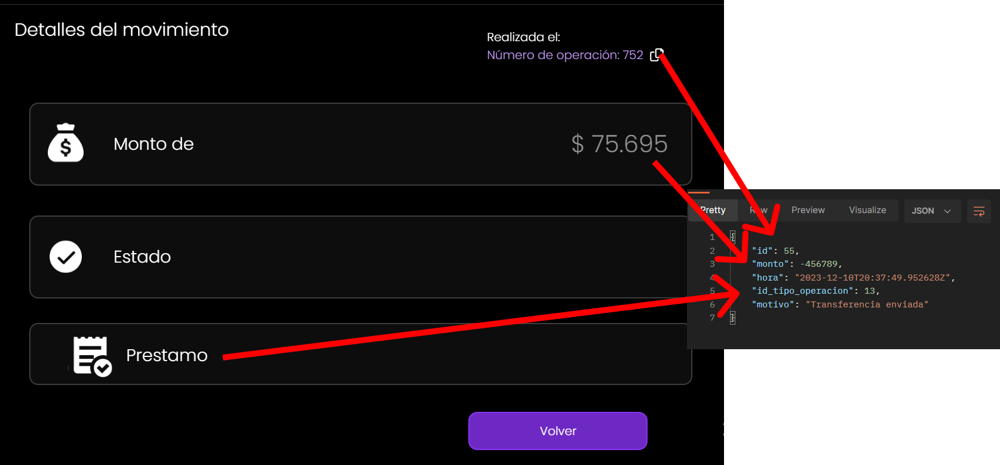
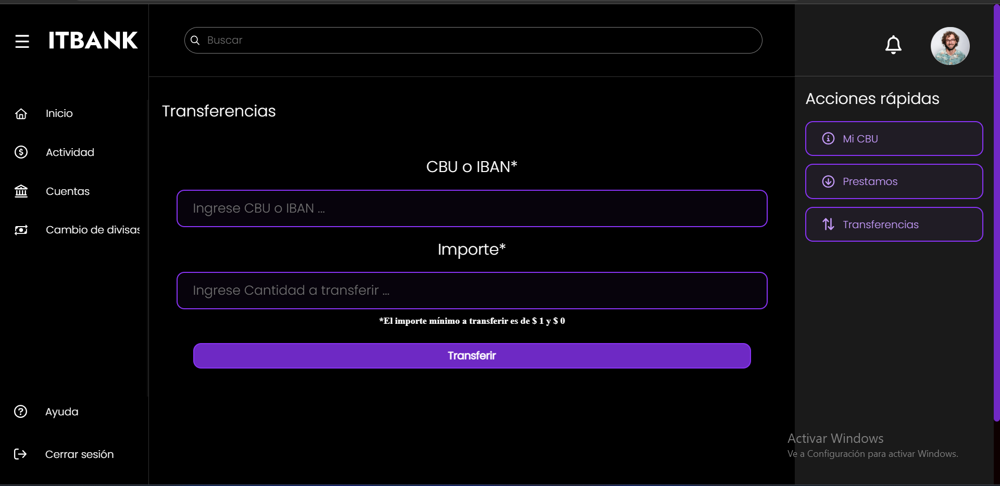
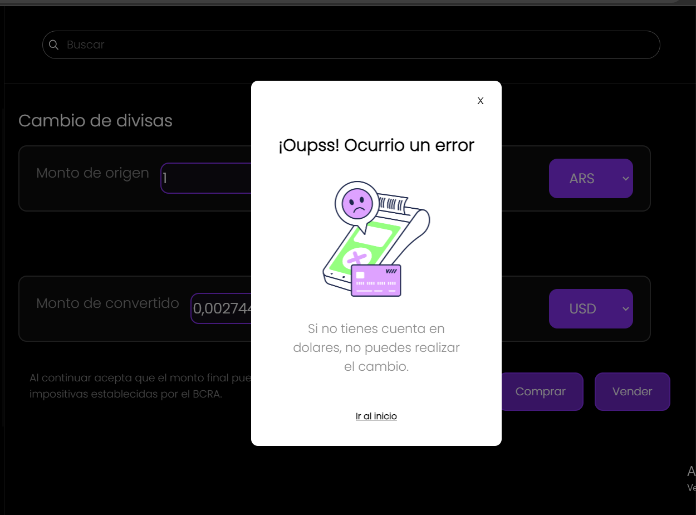
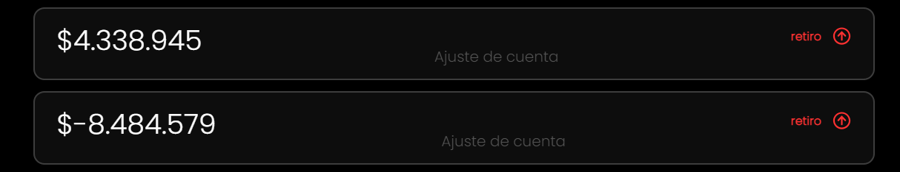
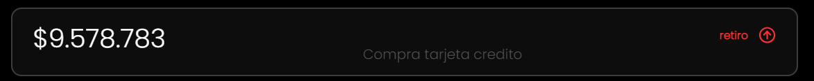
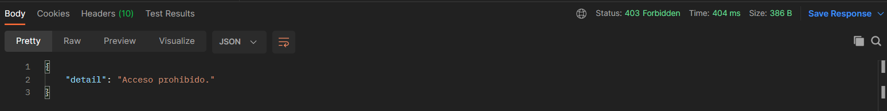
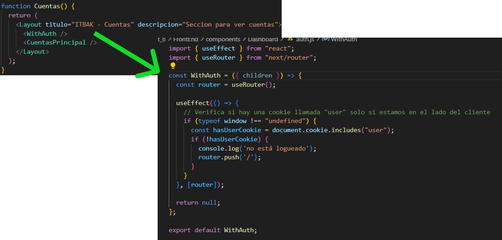
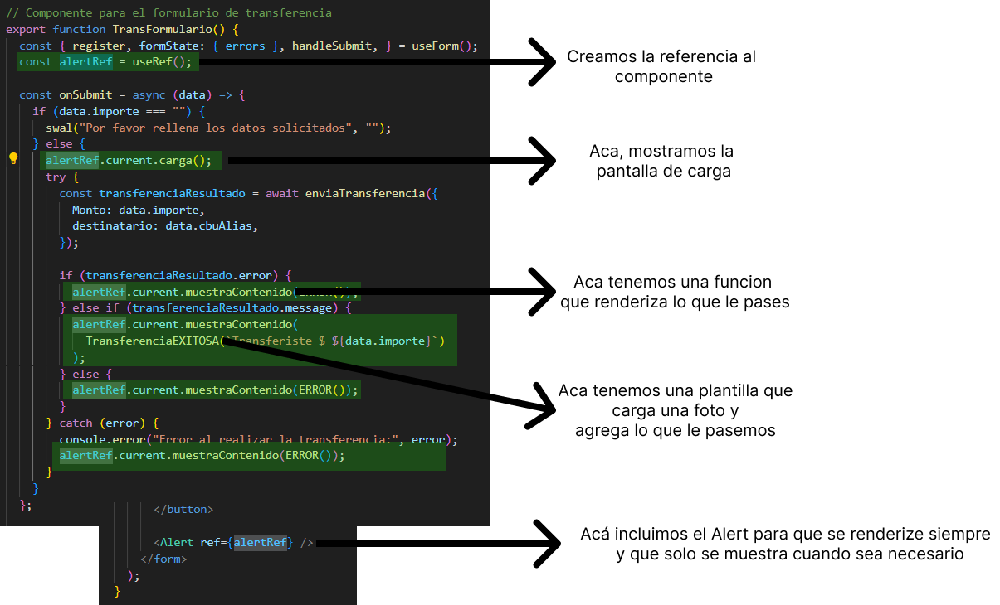
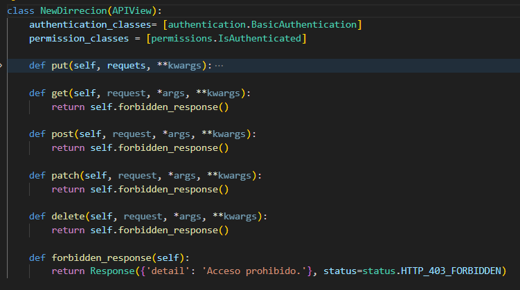

# ITBANK
Es el proyecto de una Aplicación web de Home Banking renovado para ser simple y fácil de utilizar.

El grupo que esta creando ITBANK es **iKnowHow** Conformado por: 
  - Franco Nicolás Dorrego
  - Laureano Ibarra

# Forma de Tester
1. Ingresa a sprint_8
			
		cd sprint_8
		
2.	Ingresa a BackEnd 
		
		cd BackEnd
			
3. Crea un entorno virtual, correlo e instale los siguiente:
		
		python -m venv env
		pip install -r "requirements.txt"

4. Corre el servidor de BackEnd
		
		python manage.py runserver

5. Con una nueva terminal, repite el paso 1
6.  Ingresa a FrontEnd
		
		cd FrontEnd

7. Instala las dependencias de next necesarias con, en caso de tener instalado next omitir este paso
		
		npm install    

8. levanta el servidor con
		
		npm run dev  

Y ya tienes tus dos servidores corriendo. Recuerda que todo esta configurado para que tus servidores estén en: 
	 
		BackEnd: http://127.0.0.1:8000/
		FrontEnd: http://localhost:3000/

Si no están en esos puertos, puedes tener complicaciones para que coordinen entre si.

Una vez ya todo en orden, puedes ingresar a tu URL de Front en:
		
		http://localhost:3000/

Ahi vas a ver el primer render de login, puedes ingresar con cualquier usuario del 1 al 503.

		user_1

y la clave para todos es:

		password

Luego, una vez que ingreses, puedes ver todas los servicios disponibles.

Si quieres cambiar puedes salir de la sesión y iniciar con otro usuario. Les aconsejamos probar con varios usuarios para poder ver mejor los cambios entre cada uno.

****

## <h1>EndPoint usados en Front</h1>

Para todas las vistas, se necesita estar logeado. 

En cada vista usamos GET o PUT Dependiendo la acción necesaria. 

****

Hay un endpoint el cual me da los detalles del movimiento. 

este es **/movimiento/< N >**

****

## <h1>Aclaraciones para Testear</h1>

En algunas paginas es necesario aclarar algunos puntos.

**Transferencias**

Aca te pide el IBAN y te pide un monto.

IBAN: Es el número único de una cuenta bancaria. En este caso solo te va a aceptar números registrados en la Base de datos. Podes entrar a un usuario cualquiera y copiar su IBAN de la parte de cuentas y utilizarlo para enviar o podes usar alguno de esta lista:

			Usuario 1 : NL24NWHN6414542882
			Usuario 100: LOGDSFDFD45F8328
			Usuario 300: 601RELOGDSFDFD45F8328TI601

Y el monto tiene que que estar entre 1 y el saldo de la cuenta. Si tenes saldo negativo, no vas a poder realizar la transferencia. 

****

**Cambio de Monedas**

En este cambio solo lo vas a poder realizar si tenes una cuenta en dolares, si no tenes esa cuenta, no vas a poder realizar el cambio.

****

**Datos en la DB**

La base que teníamos tenía inconsistencias en algunos datos, por ejemplo un saldo con un número pero no había movimientos. Por ello fue que todas las cuentas ahora tienen un movimiento de apertura llamado **AJUSTE_CUENTA** que es básicamente el primer movimiento.

****

Además de ello, hay **un movimiento por tarjeta de crédito** para simular una compra. 

****

## <h1>EndPoint Especiales</h1>

Se nos pedían unos puntos especiales para testear desde postman.

Para ello los puntos se basaban en Clientes y en Empleados realizando diferentes acciones.

Para esto creamos dos tipos de usuarios

		empleados: emplado_1 (Hasta el 500)
		usuarios: user_1 (Hasta el 505)

La password para ambos es **password**

Aunque se pueden probar con cualquiera se conseja el usuario 61
		
		user_61

Ya que este tiene movimientos para mostrar en la mayoría de las vistas

****

El listado de EndPoint se separan en:

Clientes: 

1. /cliente/ : Da los datos del cliente
2. /saldos/ :  Da los saldos de todas las cuentas de un cliente
3. /prestamos/ : Da el historial de todos sus prestamos

Empleados:

1. /prestamos/sucursales/< Numero > : Da los prestamos de una sucursal
2. /tarjeta/cliente/< id_cliente > :  Da las tarjetas de crédito de todo un cliente
3. PUT: /administraprestamo/ : Crea un préstamo para un cliente. Este en su heder necesita: 
****

4. DELETE: /administraprestamo/ : Elimina un préstamo, para ello necesita en el heder: 

****

Para cambiar una dirrecion solo se tiene que pasar 

		cliente: 1 | 0 --> Si es un cliente o no
		id: int --> El id del empleado o del cleinte 
		calle: str --> La calle nueva 
		cuidad: str --> La cuidad nueva
		codigopostal: int --> La codigopostal nueva
		pais: str --> La pais nueva

**Sucursales**

1. Si entras a /sucursales/ te lista todas las sucursales, no hace falta estar autenticado. 

**Manejo de Errores**

Si envias un metodo que no esta permitido te da un 403.

****

Se diseñó con el objetivo de facilitar la comprensión de todos los requisitos, aunque no esté destinado al uso de un usuario promedio. La idea es proporcionar mensajes de error que ayuden al programador que esté realizando las solicitudes, ofreciendo siempre una solución o información para abordar dichos errores.

## <h1>Auth / Logeo</h1>

Para asegurarnos de que el usuario esta logeado y así poder utilizar las funciones del banco. En cada pagina renderizamos un componente llamado **WithAuth**.

Este componente es el encargado de ver si tu sesión está activa o no, en el caso de no estarlo, te lleva al inicio donde si o si tenes que logearte. 

****

## <h1>Implementación de código</h1>

Hay algunos datos para resaltar ya sea código de front como de Back.

**Mensajes de alerta**

Los carteles de cargando y que muestran que se completó una operación, se manejan de un componente en especial que está desde el inicio de la página pero que no se muestra hasta que es necesario. 

Para esto se usa UseRef que básicamente nos permite tener acceso a un componente que se renderizo en otra parte del código, en cualquier lado. 

De esta forma es muy simple colocar los carteles de carga y éxito. 

Además de ello se crearon plantillas en especial para que este tenga un formato en particular. 

****

Los usamos en muchas paginas ya que es fácil de cargar y manipular. 

**Métodos HTTP**

Para los métodos que no estaban implementados, en vez de dar un error, damos un mensaje de acceso prohibido.

****

## <h1>Todos los EndPoint</h1>

Todos los EndPoint disponibles son:

1. *admin/* : Es el Root para ingresar a la API.
2. *sucursales/* : Lista todas las sucursales.
3. *cliente/* : Muestra los datos del usuario autenticado.
4. *saldo/* : Muestra los saldos de todas las cuentas del usuario autenticado.
5. *prestamos/* : Filtra todos los préstamos de un cliente autenticado. 
6. *prestamo/< int:pk >* : muestra los detalles de un préstamo en especial. Se pasa el ID del préstamo. 
7. *prestamos/sucursales/< int:id >/*: Muestra todos los préstamos de una sucursal, Se pasa el ID de la sucursal. 
8. *tarjeta/cliente/< int:id >/* : Lista todas las tarjetas de un cliente. Se pasa el ID del cliente. 
9. *movimientos/< int:pk >/* : Muestra el detalle de un movimiento. Tenes que pasar su ID y tiene que estar autenticado el cliente. Si pedís un ID de un movimiento que no esta asociado con ese cliente, no te devuelve nada.
10.  *movimientos/* : Lsita todos los movimientos de un cliente autenticado. 
11. *creditodatos/* : Muestra los datos de una tarjeta de crédito, Si el cliente no tiene una, se crea una automáticamente. 
12. *tarjeta/* : Muestro todos las tarjetas de un cliente autenticado.
13.  *cuenta/* : Muestra todos las cuentas de un cliente autenticado. 
14. *status/* : Muestra el total de ingreso, el total de egreso y el balance general. 
15. *administraprestamo/* : 
			PUT Crea un préstamo
			DELETE Borra un préstamo
16. *newdirrecion/* : Cambia la dirección de un cliente o empleado. 
17. *aceptaprestamos/*  : Un cliente acepta un préstamo. 
18. *realizatransferencia/* : Un cliente realiza una transferencia a una cuenta. 
19. *cambiomoneda/* : Realiza el cambio de moneda de una cuenta en Dolares a una en Pesos o viceversa. 

Para la mayoría tenes que estar autenticado como cliente y las demás como empleado. 

Si no estas autenticado. No te deja realizar ninguna operación. 

## <h1>Cierre del Proyecto</h1>

A lo largo de este proyecto vas a ver como fue mutando la aplicación de un simple HTML/CSS/JS a una aplicación funcional con Django y Next.

Esta aplicación esta lista para el uso y podes ver como fueron los pasos para llegar a esto en estas documentaciones anteriores. 

Para cerrar, esto fue un proyecto para el Instituto Tecnológico de Buenos Aires Y fue el proyecto central del programa de Full Stack

Podes ver mas sobre los integrantes del grupo en nuestro gitHub o en linkedin. 

Franco Dorrego: https://www.linkedin.com/in/francodorrego/
Laureano Ibarra: 
Evelin Gazal: 
Luciano Hermeda: 

Si bien no todos llegamos a culminar toda la formación, todos aportamos nuestra parte para que termine funcionando. 

## <h1>Documentación del sprint 1</h1>

**[Documentación](./sprint_1/README.md)**

## <h1>Documentación del sprint 2</h1>

**[Documentación](./sprint_2/README_Sprint_2.md)**

## <h1>Documentación del sprint 3</h1>

**[Documentación](./sprint_3/README_Sprint_3.md)**

## <h1>Documentación del sprint 4</h1>

**[Documentación](./sprint_4/README.md)**

## <h1>Documentación del sprint 5</h1>

**[Documentación](./sprint_5/README.md)**

## <h1>Documentación del sprint 6</h1>

**[Documentación](./sprint_6/README.md)**

## <h1>Documentación del sprint 7</h1>

**[Documentación](./sprint_7/README.md)**
