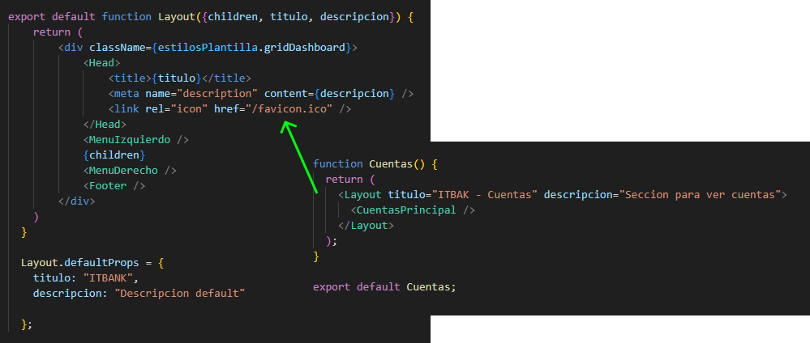
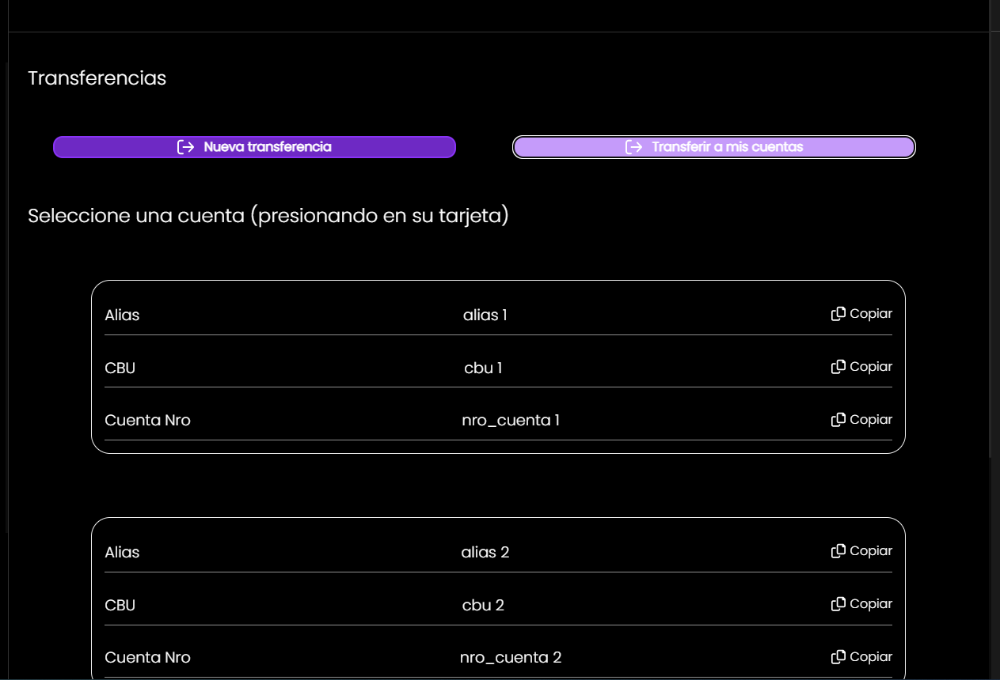
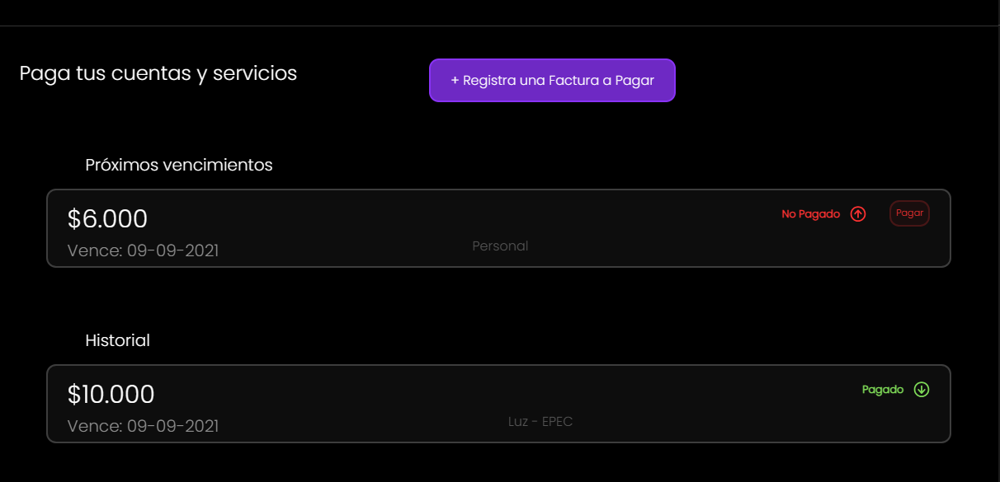
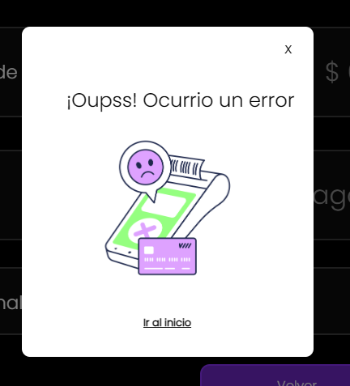

# ITBANK
Es el proyecto de una Aplicación web de Home Banking renovado para ser simple y fácil de utilizar.

El grupo que esta creando ITBANK es **iKnowHow** Conformado por: 
  - Franco Nicolás Dorrego
  - Laureano Ibarra
  - Evelyn Gazal
  - Luciano Hermida
  - Mauro Joaquin Cena

# Forma de tester

Para testearlo simplemente ingresa a la carpeta **Sprint_3** y ejecuta en la consola:

**npm install** 
**npm run build** 
**npm start** 

Este es el inicio de toda la APP, El usuario admitido es:

 - **USUARIO:** Cualquiera mayor a 6 letras.
 - **CLAVE:** Cualquiera mayor a 8 Numeros.
 - **DNI :** Cualquiera igual a 8 letras.
 - 
## <h1>Indicadores de Web Vitals</h1>

diseñamos la app web para que sea lo mas eficaz posible, siguiendo las buenas practicas de programación para cargar imágenes y scripts. Las estadísticas de rendimiento son optimas:

****

## <h1>SEO</h1>

Para cada pagina utilizamos un Layout el cual le da el formato base. Este Layout contiene una etiqueta de titulo y descripción el cual cambia según la pagina a donde este. Por precaución de que no se le pase las etiquetas se definieron etiquetas por defecto, de esa forma siempre tiene titulo y detalles.

****

Luego se cambiaron todas las etiquetas de img a Image igual que los Links para asegurar una carga optima. 

## <h1>Funcionalidades</h1>

##  Transferencias

En esta parte se usaron paginas estáticas ya cargadas en el servidor para mostrar la lista de cuentas disponibles para transferir. 

****

Luego para confirmar la transferencia que se esta por realizar se utilizo un baner el cual carga y muestra el estado de la transferencia.

****

##  Facturas

Para esta parte se coloco una lista de facturas pagas y no pagas, También se pueden agregar facturas con su boton. 

****

Luego se utilizaron paginas dinámicas para mostrar el detalle de la factura, ya sea que este paga o no. Si no lo esta te da la opcion de pagarla.

##  Manejo de errores

Los errores se manejan así

****

## <h1>Documentación del sprint 1</h1>

****

## <h1>Documentación del sprint 2</h1>

****
