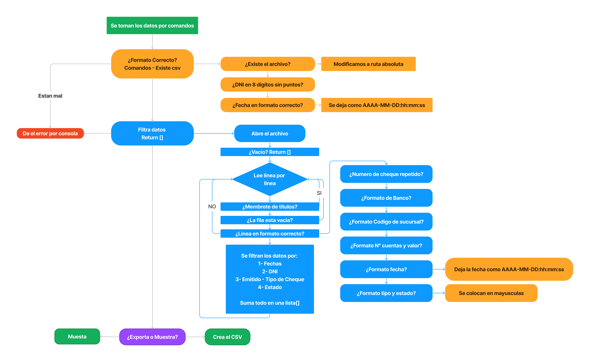

# ITBANK
Es el proyecto de una Aplicación web de Home Banking renovado para ser simple y fácil de utilizar.

El grupo que esta creando ITBANK es **iKnowHow** Conformado por: 
  - Franco Nicolás Dorrego
  - Laureano Ibarra

# Forma de Tester

Primero que nada, ingrese a la siguiente carpeta:

	cd sprint_7
	cd itbank
				
Luego, crea un entorno virtual y activelo, dentro del entorno ejecutar el siguiente comando

	pip install -r requirement.txt

Luego empieza a correr el servidor

	python -b manage.py runserver

Aca se activa el servidor y una vez que ingreses te va a pedir que te autentiques.

Para esto podes usar cualquier usuario desde el 1 al 500, sus usuarios son:
		
	user_1

y la clave para todos es:

	password

Luego, una vez que ingreses, puedes ver todas las apps sin problema.

## <h1>Diagrama de la base</h1>

Diseñamos un diagrama el cual explica como tratamos la información. La idea es tratar la información de una forma ordenada y metódica, anticiparnos a los posibles errores y ser lo mas eficiente posible.

Como se puede ver hay una tabla central de todo que es cliente, esta tabla es la mas delicada a la hora de tratarla ya que tiene muchas relaciones y otras tablas apuntándola con el customer_id

****

Tambien pueden ver todo mas en detalle en este  **[link](https://www.figma.com/file/mTLGphDg9EWaycGL1EaiJN/Untitled?type=whiteboard&node-id=0-1&t=KH8TAK1QJExl1xzR-0)**

## <h1>APPS</h1>

Nosotros para hacer este sprint, lo que hicimos fue tomar como base el sprint 3 y ver que datos era lo que usaba el font de la base de datos, Nombres, saldos, movimientos.... etc.

Cada app es un conjunto de operaciones que muestran los datos al font. 

Home: se encarga de la vista de home y todas sus subvistas 
transferencias: se encarga de mostrar las transferencias y ademas de gestionar el formulario para transferir.

Y de la misma forma con las demás. 

## <h1>Autenticación</h1>

## <h1>Documentación del sprint 1</h1>

**[Documentación](./sprint_1/README.md)**

## <h1>Documentación del sprint 2</h1>

**[Documentación](./sprint_2/README_Sprint_2.md)**

## <h1>Documentación del sprint 3</h1>

**[Documentación](./sprint_3/README_Sprint_3.md)**

## <h1>Documentación del sprint 4</h1>

**[Documentación](./sprint_4/README.md)**

## <h1>Documentación del sprint 5</h1>

**[Documentación](./sprint_5/README.md)**

## <h1>Documentación del sprint 6</h1>

**[Documentación](./sprint_6/README.md)**
