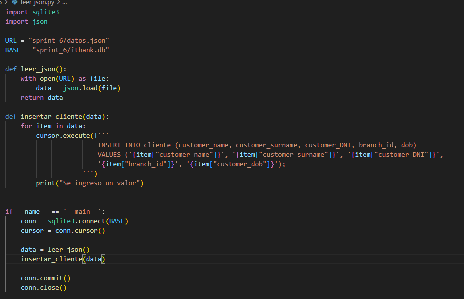

# ITBANK
Es el proyecto de una Aplicación web de Home Banking renovado para ser simple y fácil de utilizar.

El grupo que esta creando ITBANK es **iKnowHow** Conformado por: 
  - Franco Nicolás Dorrego
  - Laureano Ibarra
  - Evelyn Gazal

# Forma de Tester

Para testearlo solo hay que tomar los archivos que están en la carpeta Sprint6:

	   - primera_problematica.sql 

Y asociar la Base de datos que está disponible en la misma carpeta:

	    itbank.db

Se se ejecuta la Query completa, va a dar un error ya que nosotros agregamos columnas y estas van a estar repetidas. Por ello si se ejecuta completa hay que comentar estas líneas:

	    1168- ALTER  TABLE  cliente  ADD  COLUMN  tipo_cliente_id  INT;
	    1179- ALTER  TABLE  cuenta  ADD  COLUMN  tipo_cuenta_id  INT;

Luego funciona correctamente. 

Para las demás Query no es necesario nada más, excepto para la Query número 3 en donde se nos pide pasar de un JSON a la base de datos. Para esto formamos un Script de Python que explicamos en la sección de "Manejo de JSON" que está más abajo.

## <h1>Diagrama de relaciones</h1>

Diseñamos un diagrama el cual explica como tratamos la información. La idea es tratar la información de una forma ordenada y metódica, anticiparnos a los posibles errores y ser lo mas eficiente posible.

Como se puede ver hay una tabla central de todo que es cliente, esta tabla es la mas delicada a la hora de tratarla ya que tiene muchas relaciones y otras tablas apuntándola con el customer_id

****

## <h1>Manejo de JSON</h1>

Para la problemática 3, se nos pedía pasar un Json a datos en la DB. Para ello nosotros utilizamos un script de Python el cual:

 - Se conecta a la base de datos
 - Lee el Json
 - Inserta los datos
 - Genera un comit y cierra la conexión 

 ****

A este Script es necesario acalorarle algunas partes: 

 1. URL: es la path a donde se encuentra el archivo Json.
 2. BASE: es la path a donde se encuentra la base de datos.

Dependiendo donde se ejecute estos pueden dar error ya que varia el directorio. Controla esta parte antes de ejecutarlo.

## <h1>Tipos de movimientos</h1>

Para el Trigger de Auditoria de cuentas, se nos pedía vincular el movimiento con una descripción de la operación, para ello tomamos una tabla y colocamos todas las posibles operaciones y las asociamos a un ID. Este ID es el que une las dos tablas.

 ****

Los movimientos permitidos son:

 ****

## <h1>Documentación del sprint 1</h1>

**[Documentación](./sprint_1/README.md)**

## <h1>Documentación del sprint 2</h1>

**[Documentación](./sprint_2/README_Sprint_2.md)**

## <h1>Documentación del sprint 3</h1>

**[Documentación](./sprint_3/README_Sprint_3.md)**

## <h1>Documentación del sprint 4</h1>

**[Documentación](./sprint_4/README.md)**

## <h1>Documentación del sprint 5</h1>

**[Documentación](./sprint_5/README.md)**
