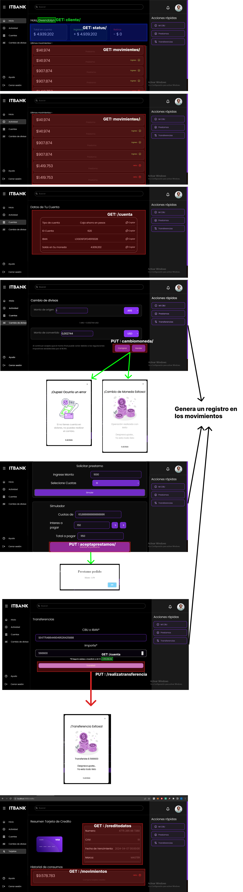

# ITBANK
Es el proyecto de una Aplicación web de Home Banking renovado para ser simple y fácil de utilizar.

El grupo que esta creando ITBANK es **iKnowHow** Conformado por: 
  - Franco Nicolás Dorrego
  - Laureano Ibarra

# Forma de Tester
1. Ingresa a sprint_8
			
		cd sprint_8
		
2.	Ingresa a BackEnd 
		
		cd BackEnd
			
3. Crea un entorno virtual, correlo e instale los siguiente:
		
		python -m venv env
		pip install -r "requirements.txt"

4. Corre el servidor de BackEnd
		
		python manage.py runserver

5. Con una nueva terminal, repite el paso 1
6.  Ingresa a FrontEnd
		
		cd FrontEnd

7. Instala las dependencias de next necesarias con, en caso de tener instalado next omitir este paso
		
		npm install    

8. levanta el servidor con
		
		npm run dev  

Y ya tienes tus dos servidores corriendo. Recuerda que todo esta configurado para que tus servidores estén en: 
	 
		BackEnd: http://127.0.0.1:8000/
		FrontEnd: http://localhost:3000/

Si no están en esos puertos, puedes tener complicaciones para que coordinen entre si.

Una vez ya todo en orden, puedes ingresar a tu URL de Front en:
		
		http://localhost:3000/

Ahi vas a ver el primer render de login, puedes ingresar con cualquier usuario del 1 al 503.

		user_1

y la clave para todos es:

		password

Luego, una vez que ingreses, puedes ver todas los servicios disponibles.

Si quieres cambiar puedes salir de la sesión y iniciar con otro usuario. Les aconsejamos probar con varios usuarios para poder ver mejor los cambios entre cada uno.

****

## <h1>EndPoint usados en Front</h1>

Para todas las vistas, se necesita estar logeado. 

En cada vista usamos GET o PUT Dependiendo la acción necesaria. 

****

## <h1>EndPoint Especiales</h1>

Se nos pedían unos puntos especiales para testear desde postman.

Para ello los puntos se basaban en Clientes y en Empleados realizando diferentes acciones.

Para esto creamos dos tipos de usuarios

		empleados: emplado_1 (Hasta el 500)
		usuarios: user_1 (Hasta el 505)

La password para ambos es **password**

Aunque se pueden probar con cualquiera se conseja el usuario 61
		
		user_61

Ya que este tiene movimientos para mostrar en la mayoría de las vistas

****

El listado de EndPoint se separan en:

Clientes: 

1. /cliente/ : Da los datos del cliente
2. /saldos/ :  Da los saldos de todas las cuentas de un cliente
3. /prestamos/ : Da el historial de todos sus prestamos

Empleados:

1. /prestamos/sucursales/< Numero > : Da los prestamos de una sucursal
2. /tarjeta/cliente/< id_cliente > :  Da las tarjetas de crédito de todo un cliente
3. PUT: /administraprestamo/ : Crea un préstamo para un cliente. Este en su heder necesita: 
****

4. DELETE: /administraprestamo/ : Elimina un préstamo, para ello necesita en el heder: 

****

## <h1>Documentación del sprint 1</h1>

**[Documentación](./sprint_1/README.md)**

## <h1>Documentación del sprint 2</h1>

**[Documentación](./sprint_2/README_Sprint_2.md)**

## <h1>Documentación del sprint 3</h1>

**[Documentación](./sprint_3/README_Sprint_3.md)**

## <h1>Documentación del sprint 4</h1>

**[Documentación](./sprint_4/README.md)**

## <h1>Documentación del sprint 5</h1>

**[Documentación](./sprint_5/README.md)**

## <h1>Documentación del sprint 6</h1>

**[Documentación](./sprint_6/README.md)**

## <h1>Documentación del sprint 7</h1>

**[Documentación](./sprint_7/README.md)**
